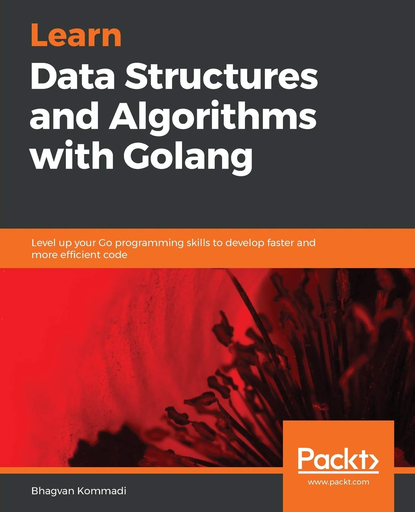
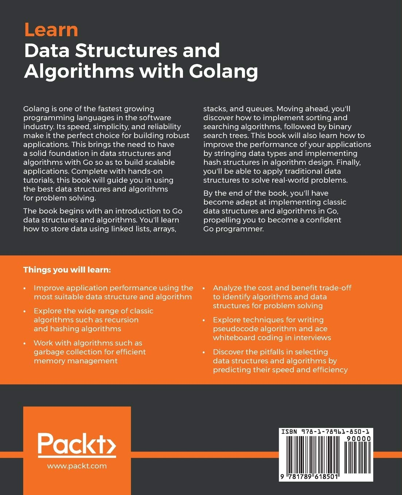

# **Data Structures and Algorithms**

This is a book review and code repository of [Learn Data Structures and Algorithms with Golang](https://www.packtpub.com/product/learn-data-structures-and-algorithms-with-golang/9781789618501) written by Bhaghvan Kommadi, and published by https://www.packt.com.

Inspired by github code repository of this book prepared in https://github.com/PacktPublishing/Learn-Data-Structures-and-Algorithms-with-Golang, we will try to cover more practical examples in 
each chapter. The core concepts of each chapters are also written in a seperate README.md file for 
more clarification.  

# **What is this book about?**

Golang is one of the fastest growing programming languages in the software industry. Its speed, simplicity, and reliability make it the perfect choice for building robust applications. This brings the need to have a solid foundation in data structures and algorithms with Go so as to build scalable applications. Complete with hands-on tutorials, this book will guide you in using the best data structures and algorithms for problem solving.

This book covers the following exciting features:

- Improve application performance using the most suitable data structure and algorithm
- Explore the wide range of classic algorithms such as recursion and hashing algorithms
- Work with algorithms such as garbage collection for efficient memory management
- Analyze the cost and benefit trade-off to identify algorithms and data structures for problem solving
- Explore techniques for writing pseudocode algorithm and ace whiteboard coding in interviews
- Discover the pitfalls in selecting data structures and algorithms by predicting their speed and efficiency


<p>


</p>

# **Instructions and Navigations**

All of the code is organized into folders. For example, Chapter02. Each chapter consists of a 
main.go file. You can run file_name.go program by preparing an extra argument for "go run" command. As a general rule, you can run a code in chapterXX folder using the following commands:

```bash
cd chapterXX \
go run . <file_name>

```
More details are considered in the README.md files of each chapter.  

# **Get to Know the Author**

Bhagvan Kommadi, the founder of Quantica Computacao and Architect Corner, has around 18 years' experience in the industry, ranging from large-scale enterprise development to incubating software product startups. He has a master's degree in Industrial Systems Engineering from the Georgia Institute of Technology (1997) and a bachelor's degree in Aerospace Engineering from the IIT Madras (1993). He is a member of the IFX forum and an individual member of Oracle JCP. He has developed Go-based blockchain solutions in the retail, education, banking, and financial service sectors. He has experience of building high-transactional applications using Java, Python, Go, Ruby, and JavaScript frameworks.